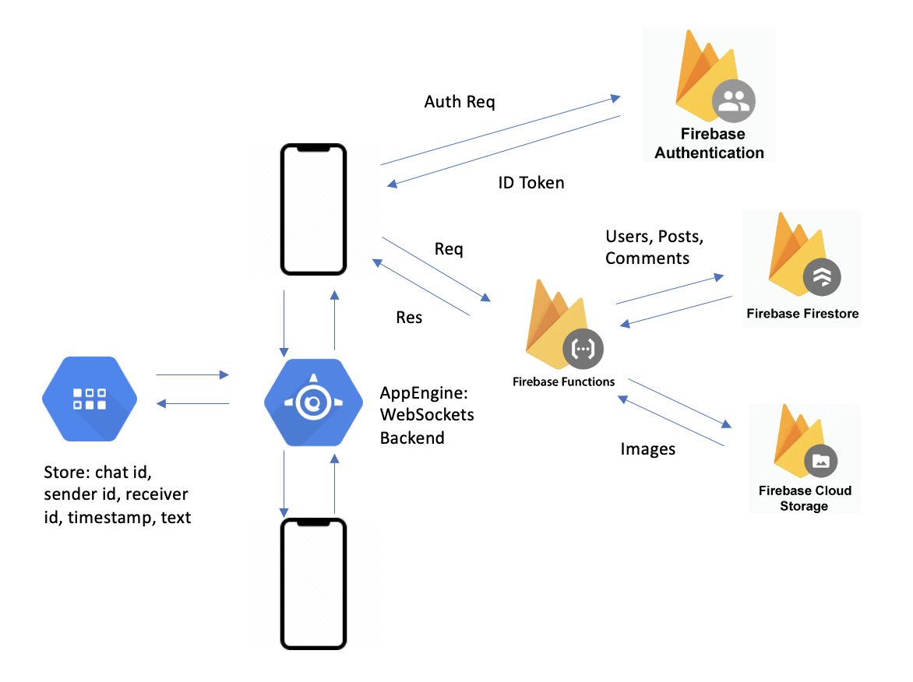

# Subtle-Dating-App

## Description of what it does
Inspired by a Facebook group called “Subtle Asian Dating” (in which friends “auction” off their single friends by writing a detailed post and include photos), we hope to create a social media platform that would allow college students to post bios of their single friends and help with the matchmaking process. 

https://firebase.google.com/docs

Users (validated college students) can go through the main feed of other posts, filter by different criteria (university, age?, race?, tags, etc), comment (publicly or privately), or make their own post for a friend.

The bio would consist of basic information including: name, university, age, major?, interests?, pros/cons list, and photos (up to 3?).

## List specifically the iOS/API technologies you think you will use
- API for fetching list of colleges in the US for the dropdown (​​https://github.com/Hipo/university-domains-list-api) when creating a post

## List specifically what you think the sources of complexity/difficulty will be
- Develop API service for receiving requests for posting  
  https://firebase.google.com/docs/functions

- Creating mock data that hopefully has at least 100 posts
- Create and host a database for storing post information  
  https://firebase.google.com/docs/firestore 

- Create and host cloud object storage for pictures  
  https://firebase.google.com/docs/storage   

- User validation as users must be university students (with a .edu email)  
  https://www.youtube.com/watch?v=vPCEIPL0U_k  
  https://stackoverflow.com/questions/8885052/regular-expression-to-validate-email-ending-in-edu

- Allowing comment functionality on posts (potentially thinking of allowing direct messaging but seems complicated), considering allowing comments to either be public (everyone can see it) or private (only the poster and commentor can see it)  
  https://www.raywenderlich.com/13209594-an-introduction-to-websockets 

Proposed Architecture Diagram:

